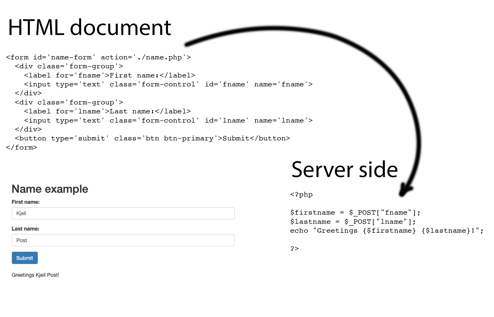
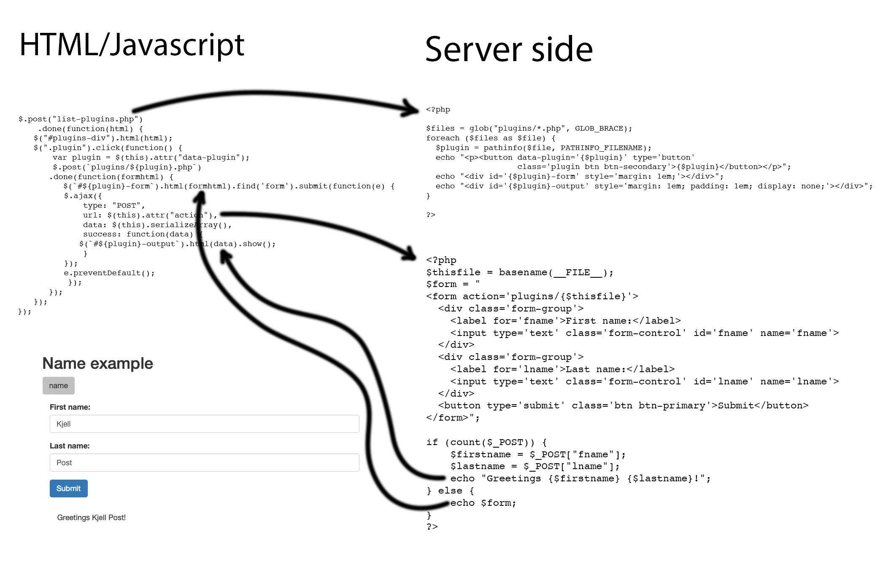

# PHP form processing scripts as standalone plugins

## Abstract
This is a proposal for creating independent plugins in a web application that
can be put in a plugin folder and appear as buttons in the HTML document which
otherwise has absolutely no knowledge of what the plugin does, or needs.

## Typical solution

In a typical web application there is a form of some sort, written in HTML,
which contains an action call to a server side script that processes the
form data, and possibly returns data to some javascript code which is inserted
into the DOM.



In this simple example we have a form that asks for the first and last name.
Upon "Submit", the script `name.php` is called to process the form and return
a string which is then inserted into the DOM.

File `index.html`:
````{verbatim}
<!doctype html>
<html lang="en">
  <head>
    <meta charset="utf-8">
    <link rel="stylesheet"
          href="https://maxcdn.bootstrapcdn.com/bootstrap/3.3.6/css/bootstrap.min.css" />
    <title>Name example</title>
    <div class='container'>
      <h2>Name example</h2>
      <form id='name-form' action='./name.php'>
        <div class='form-group'>
          <label for='fname'>First name:</label>
          <input type='text' class='form-control' id='fname' name='fname'>
        </div>
        <div class='form-group'>
          <label for='lname'>Last name:</label>
          <input type='text' class='form-control' id='lname' name='lname'>
        </div>
        <button type='submit' class='btn btn-primary'>Submit</button>
      </form>
      <br>
      <div id="name-output" style="display: none;"></div>
    </div>

  </head>
  <body>
    <script src="https://ajax.googleapis.com/ajax/libs/jquery/3.1.0/jquery.min.js"></script>
    <script src="https://maxcdn.bootstrapcdn.com/bootstrap/3.3.7/js/bootstrap.min.js"></script>
    <script>
    $(function() {
        $("#name-form").on("submit", function(e) {
            $.ajax({
                type: "POST",
                url: $(this).attr("action"),
                data: $(this).serializeArray(),
                success: function(result) {
                    $("#name-output").html(result).show();
                }
            });
            e.preventDefault();
        });
      });
    </script>
  </body>
</html>
````

File `name.php`:
````{verbatim}
<?php

$firstname = $_POST["fname"];
$lastname = $_POST["lname"];
echo "Greetings {$firstname} {$lastname}!";

?>
````

## Problem

The problem with the above solution is that knowledge of the form is an intrinsic part of the HTML document
in `index.php`, but `name.php` also knows the names of the the form elements.  

## An alternative solution

In the following example, the `name.php` is placed in a plugins folder and has been altered
to serve the form it needs:

File `plugins/name.php`
````{verbatim}
<?php

$thisfile = basename(__FILE__);
$form = "
<form action='plugins/{$thisfile}'>
  <div class='form-group'>
    <label for='fname'>First name:</label>
    <input type='text' class='form-control' id='fname' name='fname'>
  </div>
  <div class='form-group'>
    <label for='lname'>Last name:</label>
    <input type='text' class='form-control' id='lname' name='lname'>
  </div>
  <button type='submit' class='btn btn-primary'>Submit</button>
</form>";

if (count($_POST)) {
    $firstname = $_POST["fname"];
    $lastname = $_POST["lname"];
    echo "Greetings {$firstname} {$lastname}!";
} else {
    echo $form;
}
?>
````
When the plugin is called with no arguments, it returns the form it needs.
The front end application can then insert this form into the DOM and upon
submit, call the plugin again, now with form data.




File `plugin.html`:
````{verbatim}
<!doctype html>
<html lang="en">
  <head>
    <meta charset="utf-8">
    <link rel="stylesheet" 
          href="https://maxcdn.bootstrapcdn.com/bootstrap/3.3.6/css/bootstrap.min.css" />
    <title>Name example</title>
    <div class='container'>
      <h2>Name example</h2>
      <div id="plugins-div"></div>
      <div id="name-output" style="display: none;"></div>
    </div>
  </head>
  <body>
    <script src="https://ajax.googleapis.com/ajax/libs/jquery/3.1.0/jquery.min.js"></script>
    <script src="https://maxcdn.bootstrapcdn.com/bootstrap/3.3.7/js/bootstrap.min.js"></script>
    <script>
    $(function() {
        $.post("list-plugins.php")
            .done(function(html) {
                $("#plugins-div").html(html);
                $(".plugin").click(function() {
                    var plugin = $(this).attr("data-plugin");
                    $.post(`plugins/${plugin}.php`)
                        .done(function(formhtml) {
                            $(`#${plugin}-form`).html(formhtml).find('form').submit(function(e) {
                                $.ajax({
                                    type: "POST",
                                    url: $(this).attr("action"),
                                    data: $(this).serializeArray(),
                                    success: function(data) {
                                        $(`#${plugin}-output`).html(data).show();
                                    }
                                });
                                e.preventDefault();
                            });
                        });
                });
            });
    });
    </script>
  </body>
</html>
````
The main code, which has absolutely no knowledge of what the plugin does,
starts by calling a script to list all plugins in the `plugin` folder and
creating a button for each plugin.

File `list-plugins.php`:
````{verbatim}
<?php

$files = glob("plugins/*.php", GLOB_BRACE);
foreach ($files as $file) {
  $plugin = pathinfo($file, PATHINFO_FILENAME);
  echo "<p><button data-plugin='{$plugin}' type='button' class='plugin btn btn-secondary'>{$plugin}</button></p>";
  echo "<div id='{$plugin}-form' style='margin: 1em;'></div>";
  echo "<div id='{$plugin}-output' style='margin: 1em; padding: 1em; display: none;'></div>";
}

?>
````
Associated with each button there is also a `div` for the form and a `div` for the output.

After the buttons, the form div and the output div has been created, the main program
registers a click on the button to call the plugin: this will make the plugin return its
form, which is then inserted into the DOM.  When the form is submitted the main program
intercepts the call so that the browser doesn't open the plugin in a new tab.
The `ajax` call instead calls the plugin with the form data, catches the output from
the plugin and inserts it into the output `div`.

## Caveat

Different versions of jQuery have different semantics for intercepting form submit, so
if the above code does not work you are probably running a different version.
